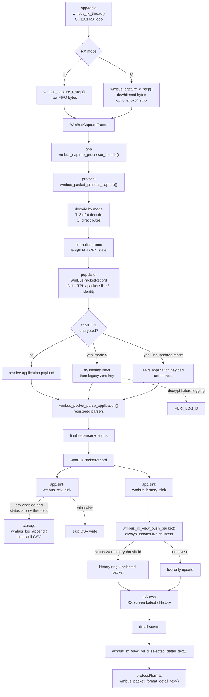

# WM-Bus Decoder (Flipper Zero)

Developer-focused notes for `applications_user/wmbus_decoder`.

## Purpose

`wmbus_decoder` is a Sub-GHz receive-only app for Wireless M-Bus at `868.95 MHz`.
It focuses on:

- link-layer RX quality (frame plausibility, length and CRC checks)
- quick field visibility on-device (manufacturer, meter ID, CI, RSSI)
- configurable packet retention/logging by decode status
- generic parser output with targeted payload extraction for Apator `AT-WMBUS-16-2`
- optional AES mode-5 decryption using keys from `keys.txt`

## Folder Layout

```text
applications_user/wmbus_decoder/
  app/         app entry point and runtime shell
  core/        shared types and compile-time config
  protocol/    packet pipeline, capture, frame, parser, crypto
  storage/     settings, paths, keyring, CSV logging
  test/        selftest harness
  ui/          scenes, views, and legacy archived UI
```

## Build and Install

From firmware root:

```bash
./fbt fap_wmbus_decoder
```

Compile-time selftests are currently enabled in `application.fam` with
`WMBUS_SELFTESTS=1`. The app runs the selftest harness before GUI/radio init and prints results through
`FURI_LOG_I` / `FURI_LOG_W`. The report is also written to
`/ext/apps_data/wmbus_decoder/selftest.txt`.

Output artifact:

- `build/f7-firmware-D/.extapps/wmbus_decoder.fap`

Deploy as you normally deploy external apps in your Flipper firmware workflow.

## Runtime Controls

- `OK`: toggle display mode (`Latest` <-> `History`)
- `Up`/`Down`: browse history only in `History` mode (`Latest` mode ignores browse keys)
- `Long OK`: open config screen
- `Long Down`: open packet detail view for the selected history entry
- `Back`: exit app

Mode and logging changes are delivered to RX through a queued runtime-config snapshot, avoiding racy shared state.

## Config Screen

The config scene currently supports:

- RX mode: `T` / `C`
- CSV logging: `None` / `Basic` / `Full`
- memory threshold: `Store if >=`
- CSV threshold: `Log if >=`
- keyring status display and key entry through the UI

CSV files are written to:

- `/ext/apps_data/wmbus_decoder/packets_basic.csv`
- `/ext/apps_data/wmbus_decoder/packets_full.csv`

Settings are persisted in:

- `/ext/apps_data/wmbus_decoder/settings.txt`

## Key File

Optional decryption keys are loaded from:

- `/ext/apps_data/wmbus_decoder/keys.txt`

Line format:

```text
00112233445566778899AABBCCDDEEFF
```

- one 16-byte AES key per line as 32 hex characters
- lines starting with `#` are ignored

Keys are tried in file order. For short-TPL mode-5 telegrams the shared packet path also tries the legacy all-zero key, but a decrypted candidate is only accepted when it has visible `2F2F` check bytes or a registered device parser validates the payload.

## Runtime View Lines

- header right: `Latest` in live mode, or `H:<pos>/<count>` in history mode
- line 1: `DEC:<decoded> Rhi:<strong RSSI> OK:<crc_ok> BAD:<crc_bad>`
  - `Rhi` counts packets with RSSI at/above strong threshold (`-70 dBm`)
- line 2: `R:<packets_per_sec>/s RSSI:<last_live_rssi>`
- line 3: `Last <status>` or `Pkt <status>`, with `A:<age>` right-aligned for the currently shown packet
- line 4: left `MF:<manufacturer> DT:<device_type>`, right `ID:<meter_id>`
- line 5: `M:<rx_mode> R:<packet_rssi>` followed by crypto status and either `CI:<ci>` or parsed total

## Mode Selection For Apator162

Apator `AT-WMBUS-16-2` can be configured to transmit either `T1` or `C1`.
There is no universal default that always works in the field.

- try `T` first in the config screen
- if counters stay at `0 decoded`, switch to `C` in the config screen
- keep the mode where decoded/CRC counters start moving

Why both are needed:

- `T` mode uses 3-of-6 coding and needs software decode/framing
- `C` mode is direct-byte with whitening and can use CC1101 variable-length packet engine

## RX/Decode Architecture

### Packet flow



### Radio

- CC1101 custom preset for WM-Bus receive at `868.95 MHz`
  - baseline matches the TI Radio Link B receive preset, with mode-specific packet handling patched at runtime
- mode-specific packet handling:
  - `T`: infinite-length RX, software framing
  - `C`: infinite-length RX with hardware dewhitening; software strips an optional leading signaling byte before WM-Bus parsing

### Packet processing

1. Capture path by mode:
- `T`: stream raw FIFO bytes, estimate expected raw length from decoded `L-field`, complete on timeout/full/expected-length.
- `C`: stream dewhitened FIFO bytes, tolerate an optional leading `0x54` C-mode signaling byte, then parse the remaining bytes as a normal WM-Bus frame.
2. Decode path:
- `T`: 3-of-6 decode into byte stream.
- `C`: direct byte stream after signaling-byte stripping.
3. Plausibility gates:
- minimum header length
- valid `L-field`
- valid WM-Bus `C-field` (`0x44` or `0x46`)
- valid manufacturer code shape
4. Length + EN13757 CRC checks.
5. Build a generic packet record, run shared decrypt candidate selection, then let registered device parsers claim validated payloads before routing the record through:
- memory history sink filtered by status threshold
- CSV sink filtered by status threshold and CSV mode

### Frame format handling

- Frame format (`A`/`B`) is selected by `L-field` length fit plus DLL CRC validation.
- Preferred order is currently `A` then `B`, with fallback when CRC is bad.
- Once selected, DLL CRC bytes are stripped before CI/TPL/vendor parsing and model updates.

## Apator `AT-WMBUS-16-2` Parsing

A targeted parser extracts total volume from Apator proprietary register payloads.

The vendored upstream reference is `wmbusmeters/drivers/src/apator162.xmq`. That grammar models the proprietary payload as:

- one leading proprietary marker byte
- seven status bytes
- zero or more typed proprietary fields
- an `0xFF` terminator followed by optional trailing bytes

Current app behavior:

- claims only Apator short-TPL packets with `CI == 0x7A`
- accepts Apator identity fields matching the upstream detector: version `0x05`, device type `0x06` or `0x07`, plus manufacturer `APA`
- also accepts the legacy manufacturer code `0x8614` used by existing local regression vectors
- skips leading `0x2F` fillers in the application payload
- always treats the next 8 bytes as the proprietary prefix from the upstream grammar:
  - 1 marker byte
  - 7 status bytes
- walks the payload using the proprietary register-size table derived from the upstream grammar
- extracts the first total-volume field from register `0x10` or `0xA1`
- stores the parsed total as `m3 * 1000`

Displayed on the normal UI when parser-provided primary fields are available, for example:

- `3.843 m3`
- `Key:#2`

Known limit (intentional):

- old-style Apator telegrams (`CI == 0xB6`) are not decoded.

## References

- `wmbusmeters/drivers/src/apator162.xmq`
